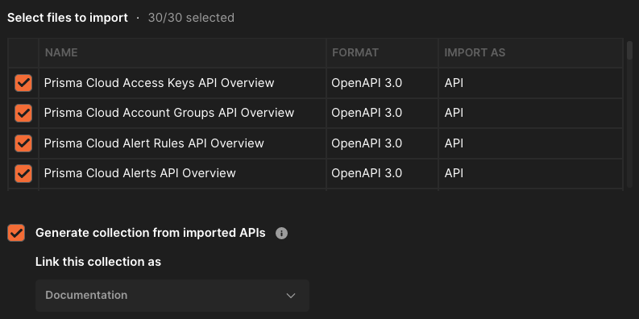
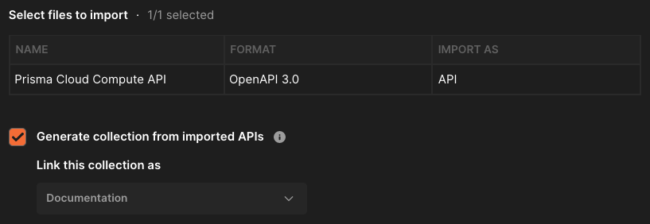
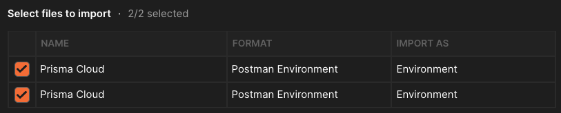

# Instructions on how to setup the Postman Collections and Environment relating to Prisma Cloud APIs

There are 2 main _pillars_ of Prisma Cloud APIs today, and this will cover both of them. 
* Cloud Security Posture Management (CSPM)
* Cloud Workload Protection (CWP)

All current API documentation is now at [prisma.pan.dev](https://prisma.pan.dev/)

There might be more pillars in the future, and this will be updated accordingly. 

## To use these Collections and Environment, there are a few setup pieces before you can get started in Postman:

### Collections
1. You will need to [import multiple files into](https://learning.postman.com/docs/getting-started/importing-and-exporting-data/) Postman

* For the CSPM APIs, there are currently multiple files to import, hosted in the **_cspm_** folder of [this GitHub folder](https://github.com/PaloAltoNetworks/prisma.pan.dev/tree/master/static/oas) (which is what the main [prisma.pan.dev](https://prisma.pan.dev/) site is based on)

   * You will want to import all 30 (or more) **.yaml** files into Postman. **Don't** include the `sidebar.js` or the `dist` folder.

* For the Compute (CWP) APIs, starting with Compute release `21.04`, the OpenAPI Spec file can be downloaded directly from the Console. (You can also download the individual files at the same [link](https://github.com/PaloAltoNetworks/prisma.pan.dev/tree/master/static/oas) as above, just in the **_cwpp_** folder)

   * Navigate and download the file at: **_Compute > Manage > System > Utilities > OpenAPI Spec (Beta)_**, and import this into Postman. 

### Environment
1. The only 2 files you will need to import from this repo are the Prisma Cloud environments:
* [CSPM_Prisma_Cloud.postman_environment.json](CSPM_Prisma_Cloud.postman_environment.json)
* [CWP_Prisma_Cloud.postman_environment.json](CWP_Prisma_Cloud.postman_environment.json)

---
**NOTE**

You just need to remember to switch between the CSPM and CWP environments depending on what API you are currenlty calling. 

---

1. After importing, we need to set some variables and authorization within Postman. You will need to configure:
    1. baseUrl
    1. compute-api-endpoint
    1. ACCESS_KEY
    1. SECRET_KEY

1. To get the address/URL for your Console, go to *Compute > Manage > System > Downloads*, and copy the string under **Path to Console**
**The URL should look something like this:** https://us-east1.cloud.twistlock.com/us-1-123456789
   1. You will be replacing the **compute-api-endpoint** variable

1. Depending on what Admin console you see when you log in will determine which API Endpoint you will use. 
   1. The corresponding value below will replace the **api-endpoint** variable.

Prisma Cloud Admin Console | 	Prisma Cloud API Endpoint
------------ | -------------
https://app.prismacloud.io	| https://api.prismacloud.io
https://app2.prismacloud.io	| https://api2.prismacloud.io
https://app3.prismacloud.io	| https://api3.prismacloud.io
https://app4.prismacloud.io	| https://api4.prismacloud.io
https://app.anz.prismacloud.io	| https://api.anz.prismacloud.io
https://app.eu.prismacloud.io	| https://api.eu.prismacloud.io
https://app2.eu.prismacloud.io	| https://api2.eu.prismacloud.io
https://app.gov.prismacloud.io	| https://api.gov.prismacloud.io
https://app.prismacloud.cn	| https://api.prismacloud.cn
https://app.ca.prismacloud.io	| https://api.ca.prismacloud.io
https://app.sg.prismacloud.io	| https://api.sg.prismacloud.io

## The rest of the variables shouldn't need altered, and are either auto-generated or for future or other scenarios.
The below table shows an example of what a completed Environment should look like **before** generating any JWT tokens

Postman Variable | Use | Value/Example
------------ | ------------- | -------------
api-endpoint | Main API endpoint for Prisma Cloud requests | api.prismacloud.io
token	| JWT token auto-generated after the /login request | 
compute-api-endpoint	| API endpoint for all things within the Compute tab | https://us-east1.cloud.twistlock.com/us-1-123456789
compute-token	| JWT token auto-generated after the Compute /authenticate request | 
api-version | Used only for the Compute collection for future API versions | v1
console-port | Used only for self-hosted versions of the Compute Console | 

## Advanced Postman scenarios using Collection Runner

In the **Collection_Runner** folder, there are specific examples for use-cases where using Postman's Collection Runner makes sense. 

This is an easy way to iterate through files/CSVs/etc for a specific subset of API calls you want to make. More instructions in the README within [this folder](https://github.com/PaloAltoNetworks/pcs-postman/tree/main/Collection_Runner).

## That's it! The Collections are not fully complete, so if you find a request that hasn't been created (or needs updated) please feel free to submit a PR. 

## Accessing Multiple Tenants
You can easily switch between Prisma Cloud Tenants by creating multiple Environments. To do this just import the `Prisma Cloud.postman_environment.json` file again and set the new api endpoints and credentials. Be sure to change the environment name so you can tell your environments apart! 